# HTTPのメソッド
HTTPのメソッドは、クライアントがサーバーに対して行いたい操作を示す。主なメソッドには以下がある:
- **GET**: リソースの取得
- **POST**: 新しいリソースの作成
- **PUT**: 既存リソースの更新
- **DELETE**: リソースの削除
- **HEAD**: ヘッダのみ取得
- **OPTIONS**: サーバを調査
- **TRACE**: ネットワーク経路をチェック
- **CONNECT**: TCPトンネルを接続

# HTTPのステータスコード
HTTPのステータスコードはHTTPのレスポンスの最初に返され、サーバーがクライアントのリクエストに対してどのような応答をしたかを示す。大きく次のものがある:
- **100番台**: 情報レスポンス
- **200番台**: 成功レスポンス=>処理が成功した場合に返される
- **300番台**: リダイレクションメッセージ=>他のページへの転送を意味するため、ブラウザは他のURLに続けてアクセスすることを元めっられる
- **400番台**: クライアントエラー=>Webブラウザからのリクエストが正しくない場合に返される
- **500番台**: サーバーエラー=>Webサーバ側のエラーが起きた場合に返される

主なステータスコードには以下がある：
- **200 OK**: リクエストが成功した。
- **201 Created**: 新しいリソースが作成された。
- **301 Moved Permanently**: 要求されたリソースは恒久的に移動した。Locationヘッダにより、リダイレクト先が返される。
- **302 Found**: 発見したが、要求されたリソースは一時的に移動している。Locationヘッダにより、リダイレクト先が返される。
- **400 Bad Request**: リクエストが不正である。
- **401 Unauthorized**: 認証が必要である。
- **403 Forbidden**: 禁止されている（アクセス権がない）。
- **404 Not Found**: リソースが見つからない。
- **500 Internal Server Error**: サーバー内部でエラーが発生した。

# Djangoのコントローラーとは
DjangoのコントローラーはMVCのCを表し、リクエストを受け取り、適切なレスポンスを返す役割を持つコンポーネントだ。ModelとViewの橋渡し役で、Djangoではコントローラーは「ビュー」と呼ばれる。

# コントローラーによるリクエスト処理:MVCとの対応
MVC（Model-View-Controller）パターンにおいて、ControllerはModelに指示を出し、Modelから得た結果とともにViewに出力を指示する。Controllerにあたるviews.pyでは主に以下の処理が行われる。
・リクエストからのデータ取り出し
・Modelへのアクセス
・レスポンスの生成
  -render関数により、HTTPResponseを返す
  -redirect関数により、リダイレクトする
  -例外を発生し、エラーを返す

# リクエストからのデータ取り出し
Djangoのビューでは、リクエストオブジェクトを通じてクライアントから送信されたデータを取り出すことができる。例えば、GETパラメータやPOSTデータを取得するには以下のようにする:
```python
def my_view(request):
    get_param = request.GET.get('param_name')
    post_data = request.POST.get('data_name')
```

# レスポンスの生成:render関数
render関数は、テンプレートを使用してHTMLレスポンスを生成するために使用される。以下はその例:
```python
from django.shortcuts import render

def my_view(request):
    context = {'key': 'value'}
    return render(request, 'template_name.html', context)
```

# レスポンスの生成:redirect関数
redirect関数は、指定されたURLにリダイレクトするレスポンスを生成する。以下はその例:
```python
from django.shortcuts import redirect

def my_view(request):
    return redirect('some_view_name')
```

# レスポンスの生成：例外の発生
Djangoでは、特定の条件下で例外を発生させることでエラーレスポンスを生成することができます。例えば、Http404例外を発生させると404エラーページが表示される:
```python
from django.http import Http404

def my_view(request):
    if some_condition:
        raise Http404("Page not found")
```
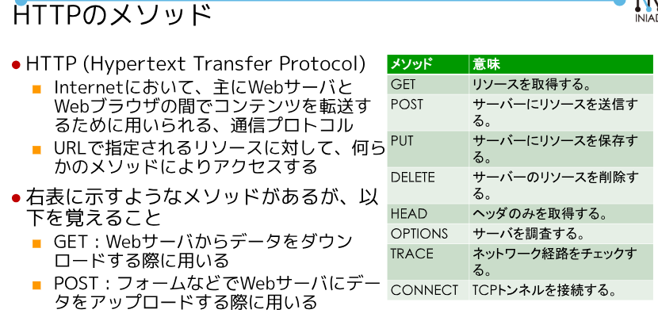
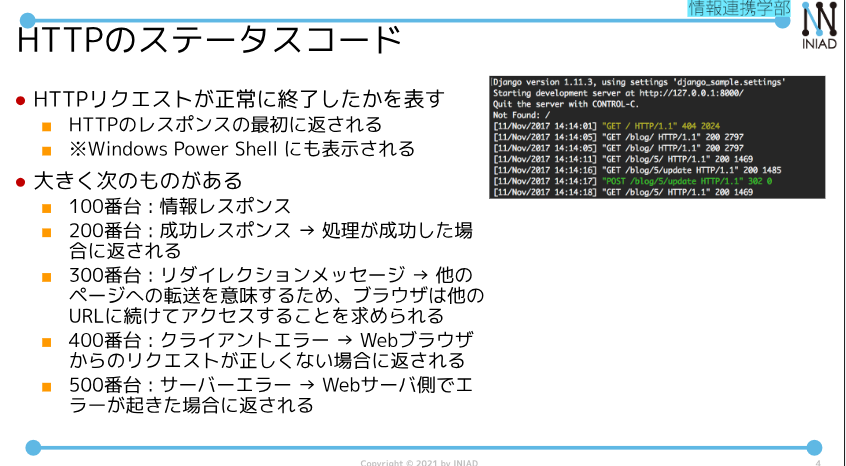
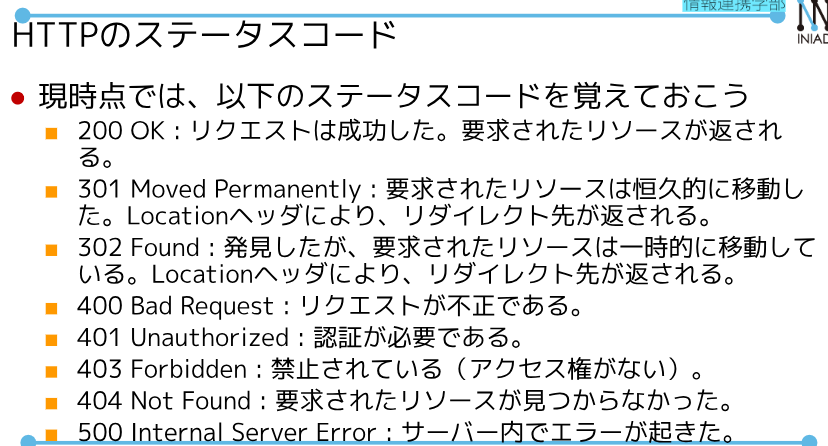
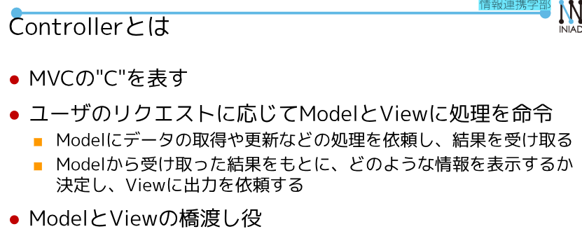
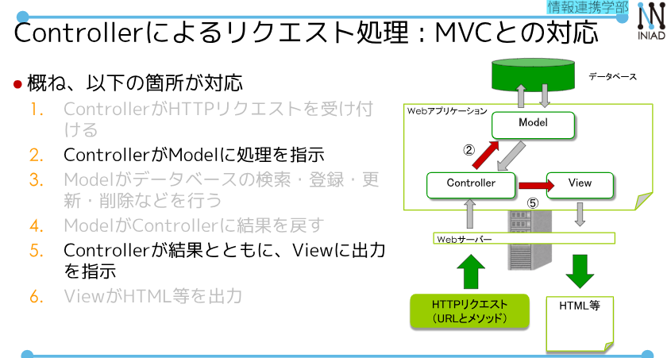
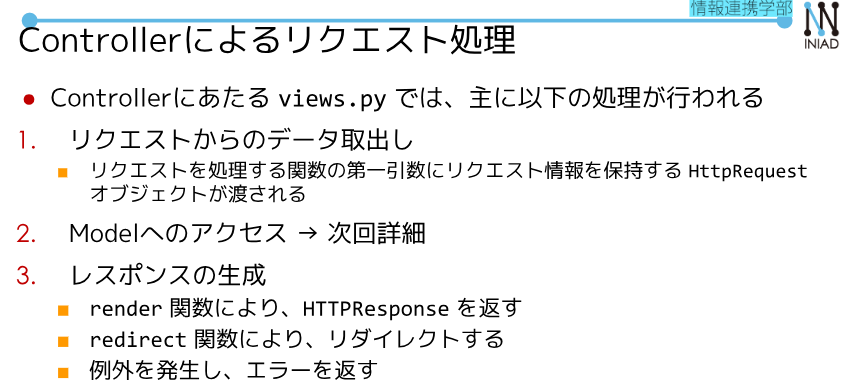
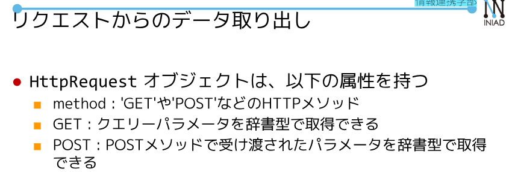
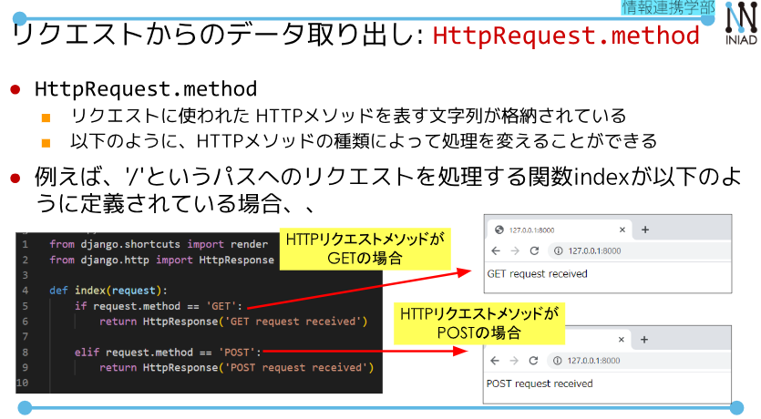
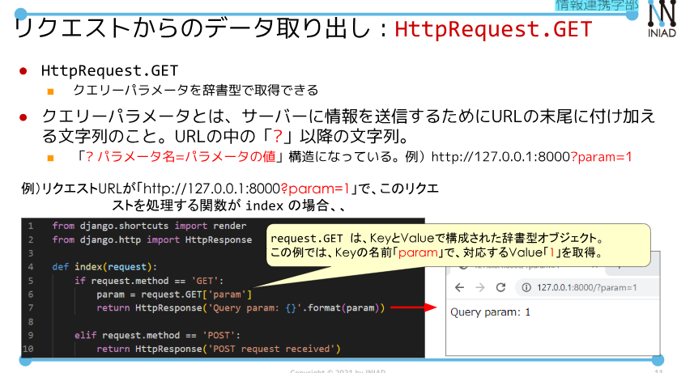
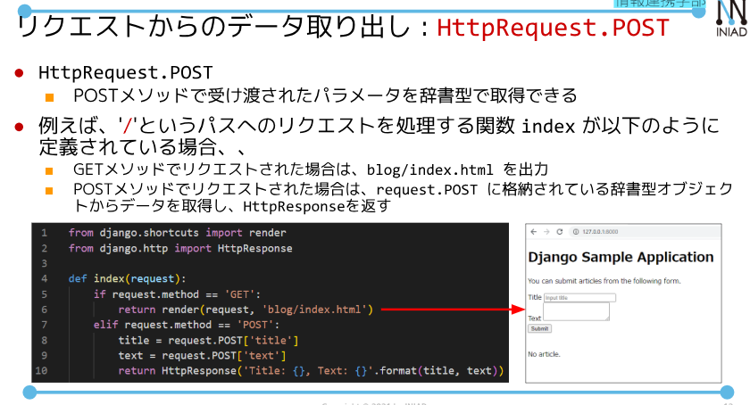
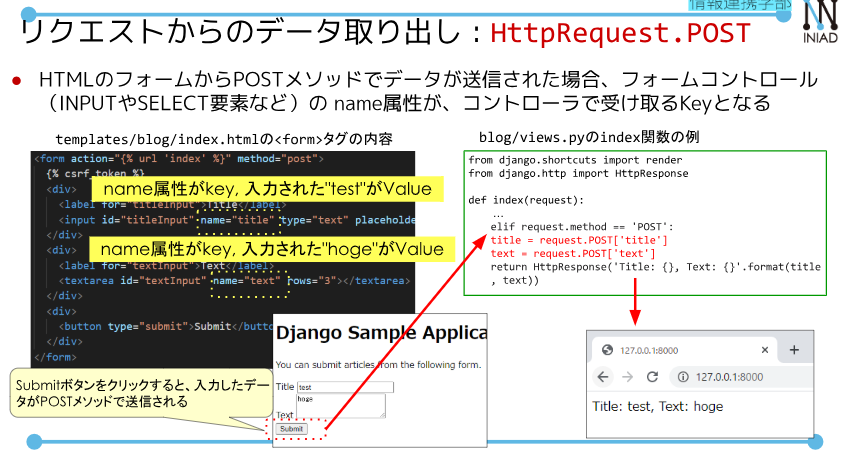
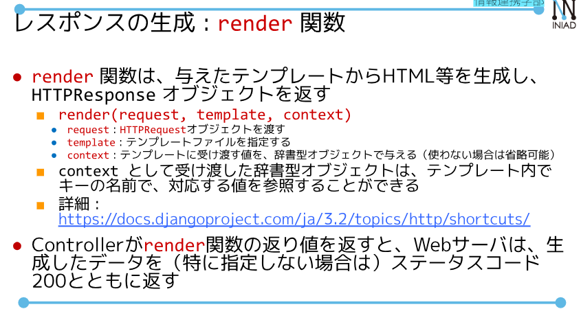
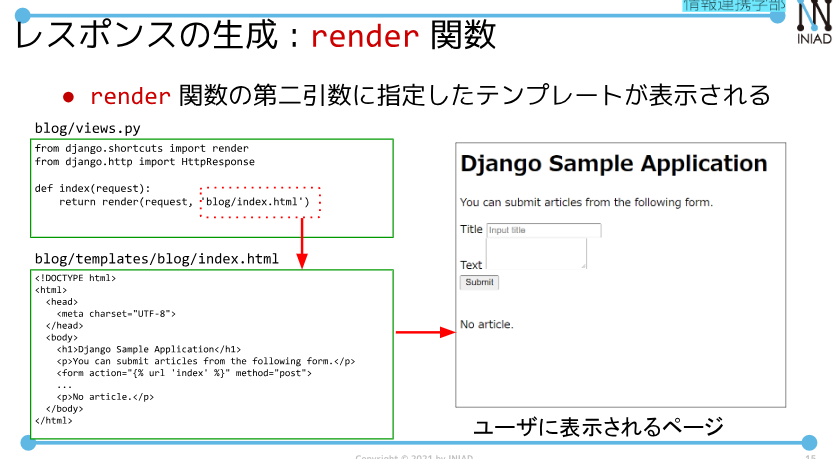
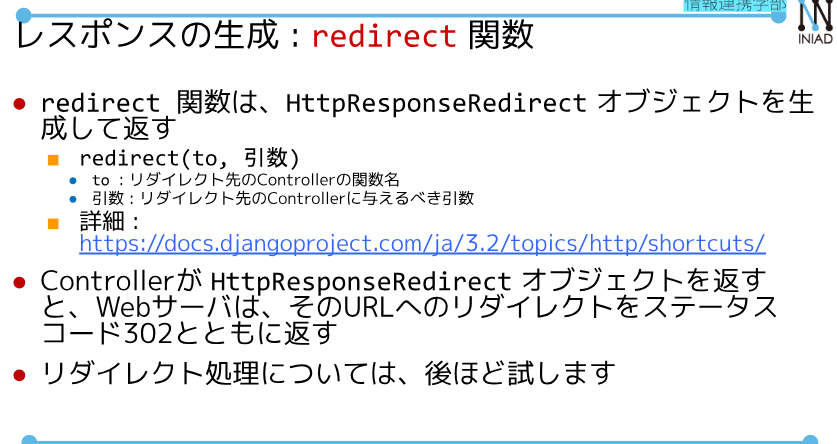
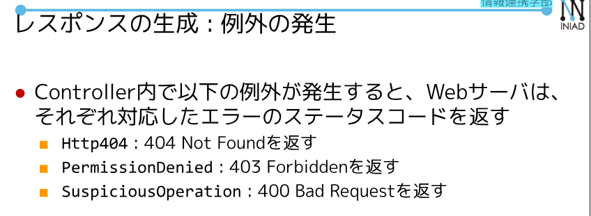