# Djangoテンプレート言語の基本構文

## 変数の表示
テンプレート内で変数を表示するには、二重中括弧 `{{ }}` を使用します。
```html
{{ 変数名 }}
```
## 属性の表示
変数の属性を表示するには、ドット . を使用します。
```html
{{ 変数名.属性名 }}
```

## フィルターの使用
フィルターを使用して変数の値を変換できます。フィルターはパイプ | で指定します。
```html
{{ 変数名 | フィルタ名 }}
```

## forループ
リストの各要素に対してループを実行するには、 タグを使用します。
```html

    <!-- ループ内の処理 -->

```

## if文
条件分岐を行うには、 タグを使用します。
```html

    <!-- 条件が真の場合の処理 -->

    <!-- 条件が偽の場合の処理 -->

```
## URLの逆引き
URLの逆引きを行うには、 タグを使用します。
```html

```

## 静的ファイルの読み込み
静的ファイルをテンプレートに含めるには、 タグを使用します。
```html

```

## 静的ファイルのパス
静的ファイルのパスを取得するには、 タグを使用します。
```html

```

## CSRFトークン
フォームにCSRFトークンを含めるには、 タグを使用します。
```html

```
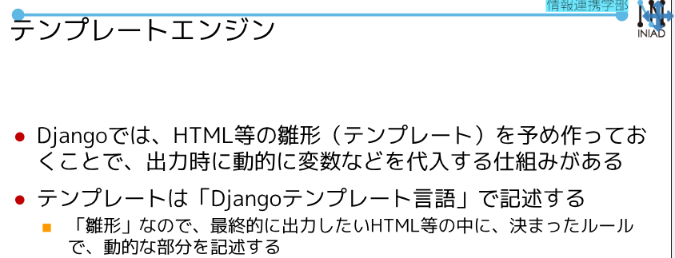
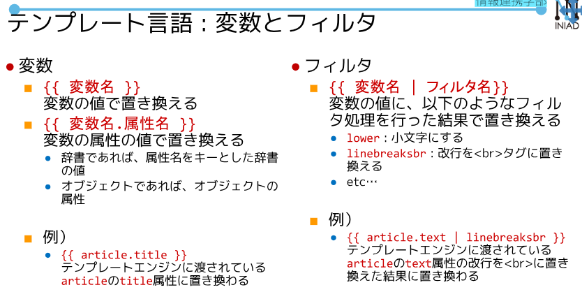
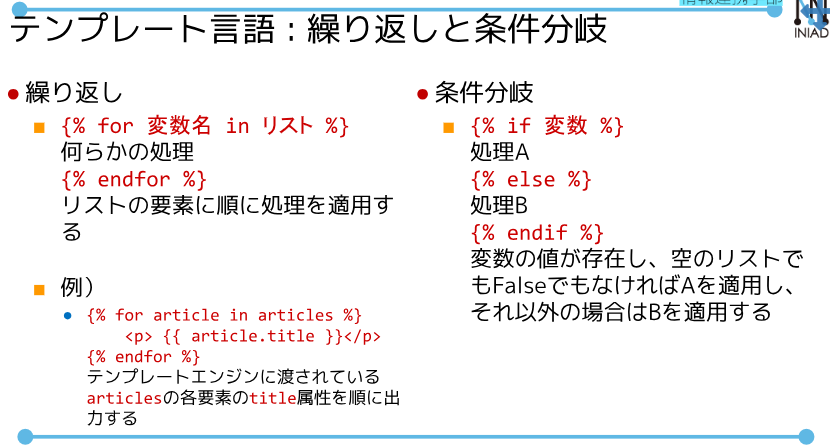
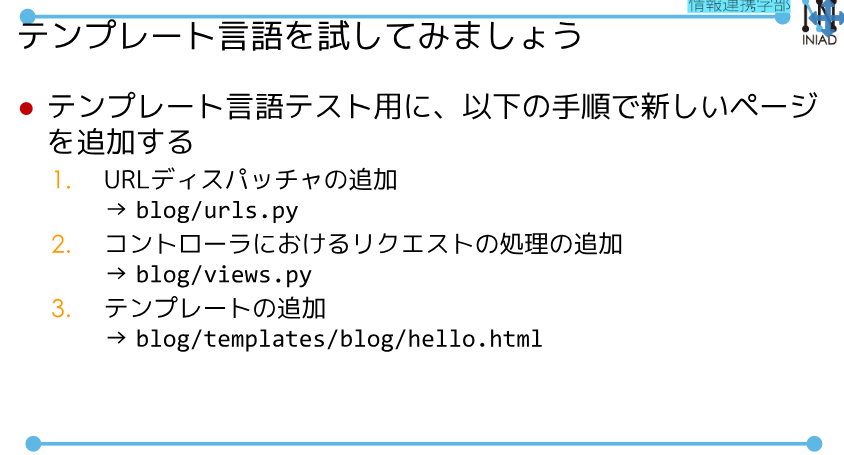
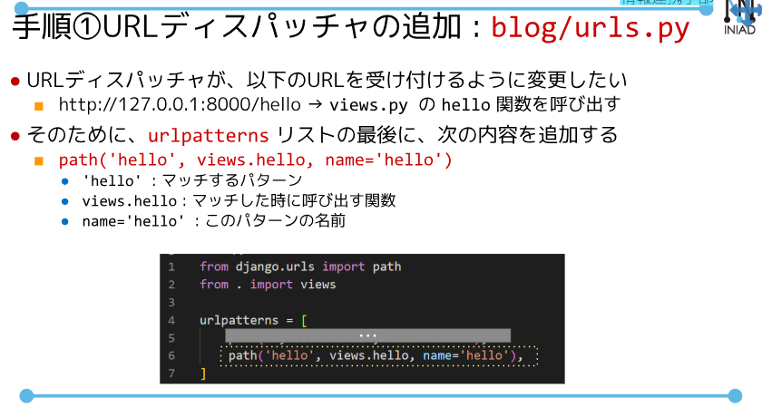

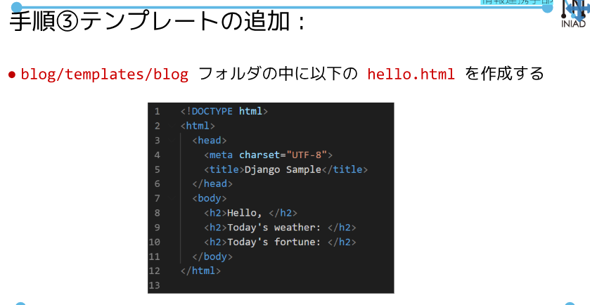
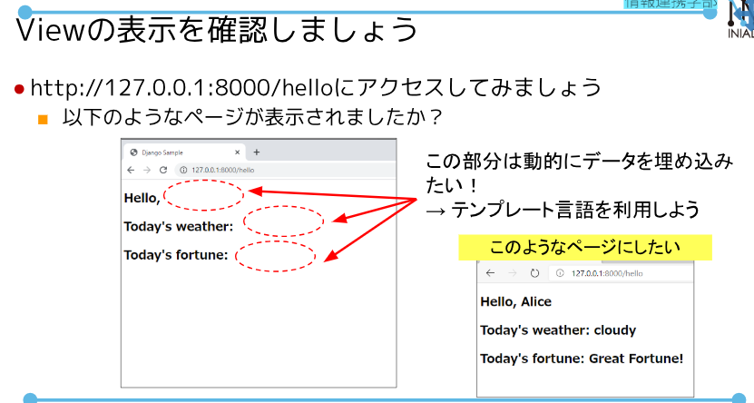
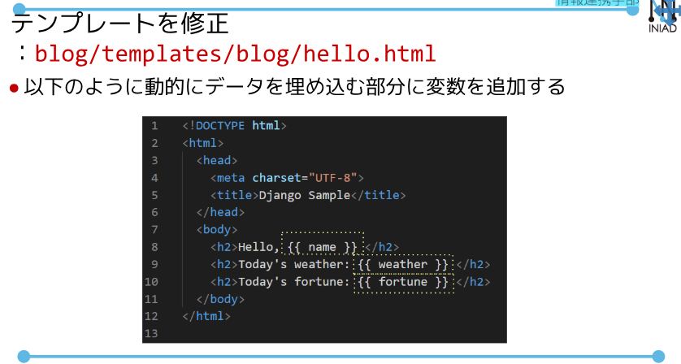
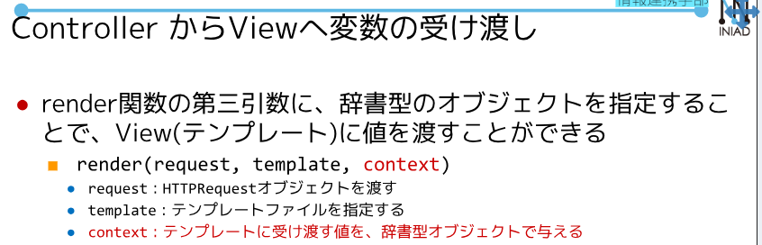
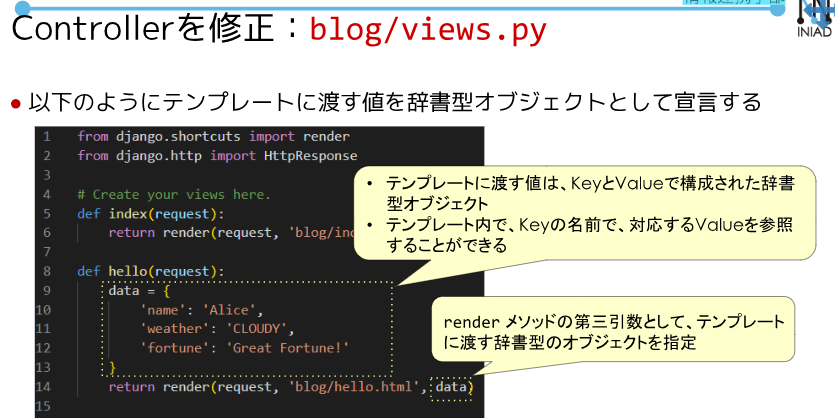
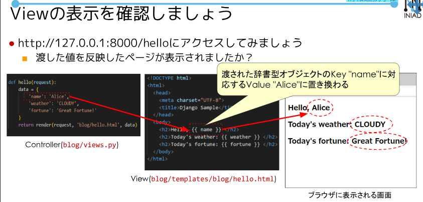
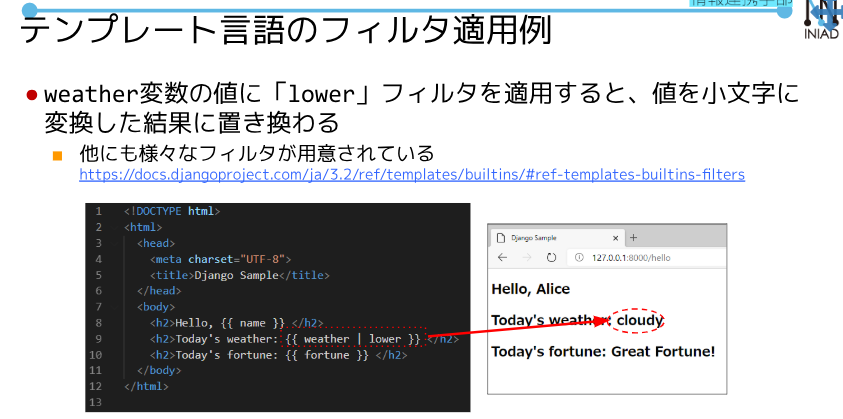
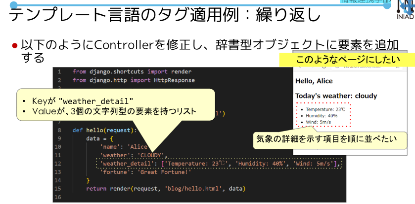
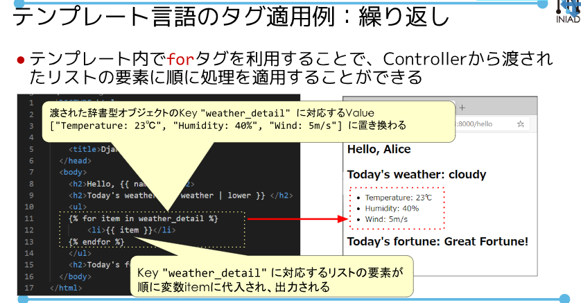
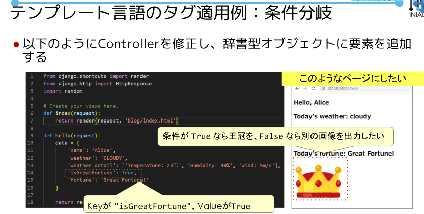
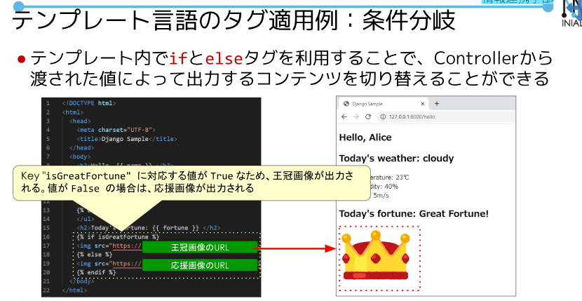
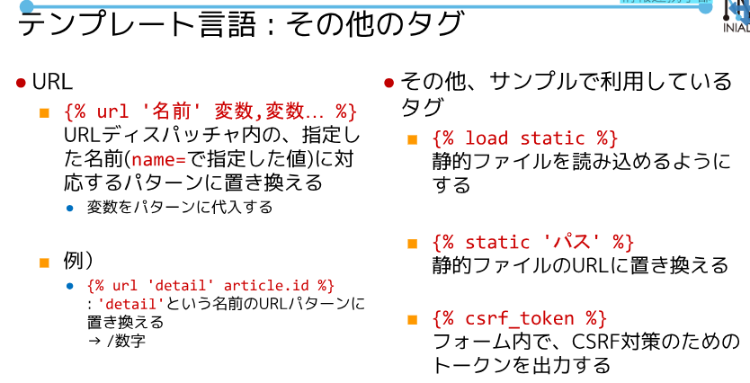
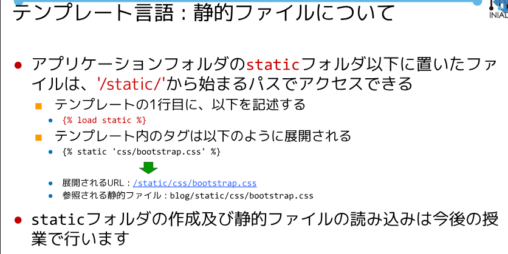
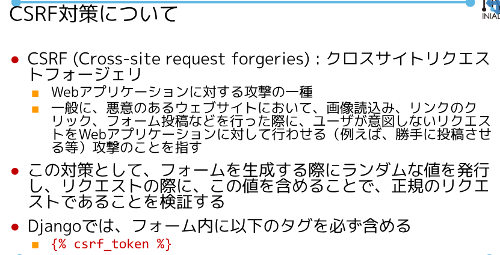
