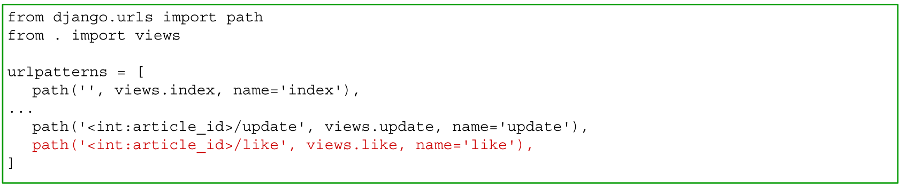
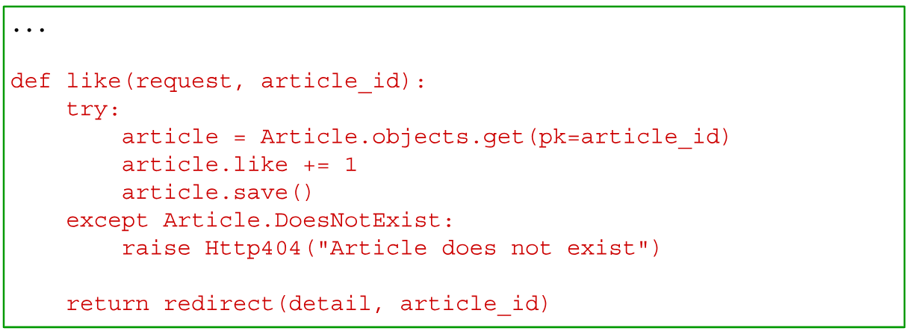
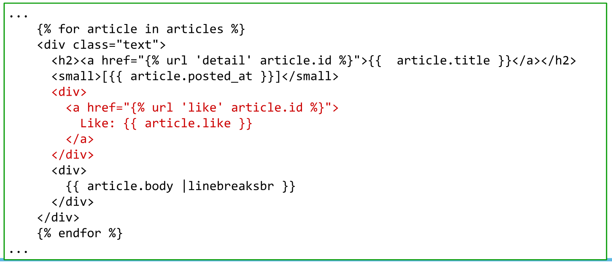

## いいね機能の追加
***
### 手順
1. URLディスパッチャの追加
   - → blog/urls.py
2. Controllerにおけるリクエストの処理の追加
   - → blog/view.py
3. テンプレートの編集
   - → blog/templates/blog/index.html

### 1. URLディスパッチャの追加
- 操作ファイル：blog/urls.py
- <article_id>/like → views.like を呼び出す

### 2. Controllerへの処理の追加
- 操作ファイル：blog/view.py
- views.like 関数を定義する
    1.  オブジェクトを取り出す(無ければ404)
    2.  変数likeを変更、保存
    3.  views.detail にリダイレクト

### 3. テンプレートの編集
- 操作ファイル：blog/templates/blog/index.html
- 「いいね」のリンクを追加する

