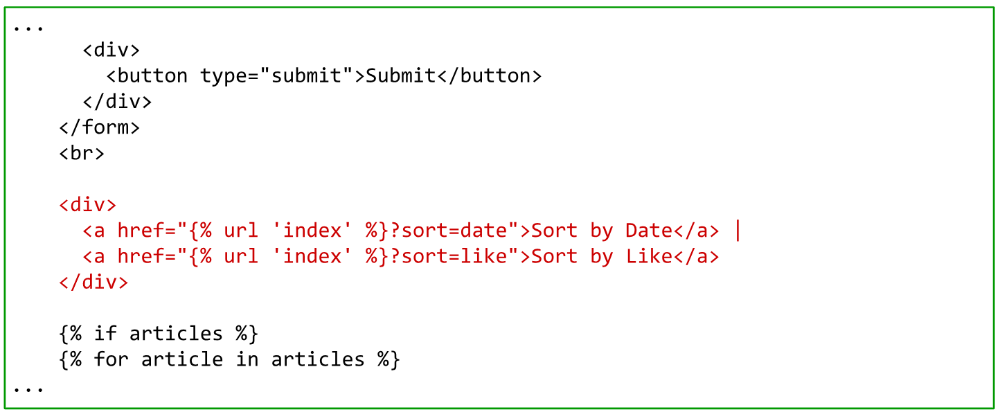
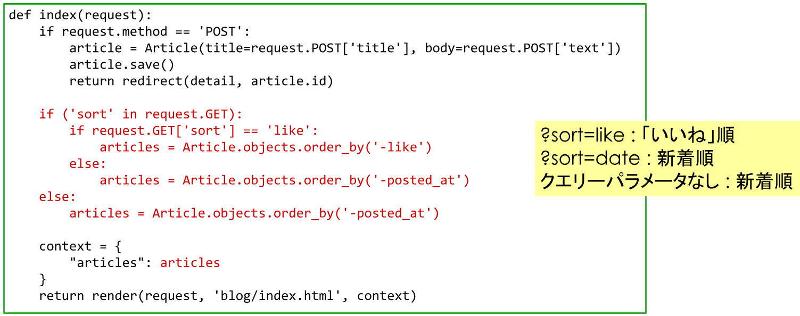

## ソート機能の追加
***
### 手順
1. テンプレートの編集
   - → blog/templates/blog/index.html
2. Controllerにおけるリクエストの処理の追加
   - → blog/view.py

### 1. テンプレートの編集
- 操作ファイル：blog/templates/blog/index.html
- ソートのためのリンクを追加する

### 2. Controllerへの処理の追加
- 操作ファイル：blog/view.py
- index 関数を編集する

